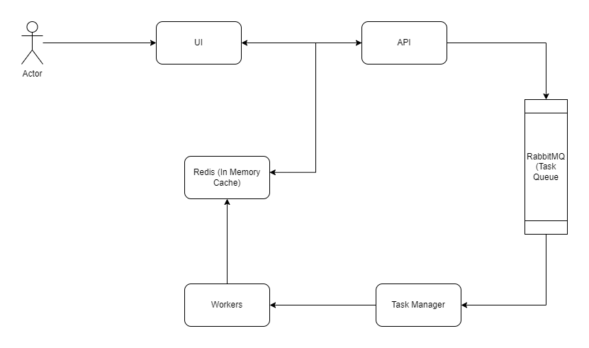
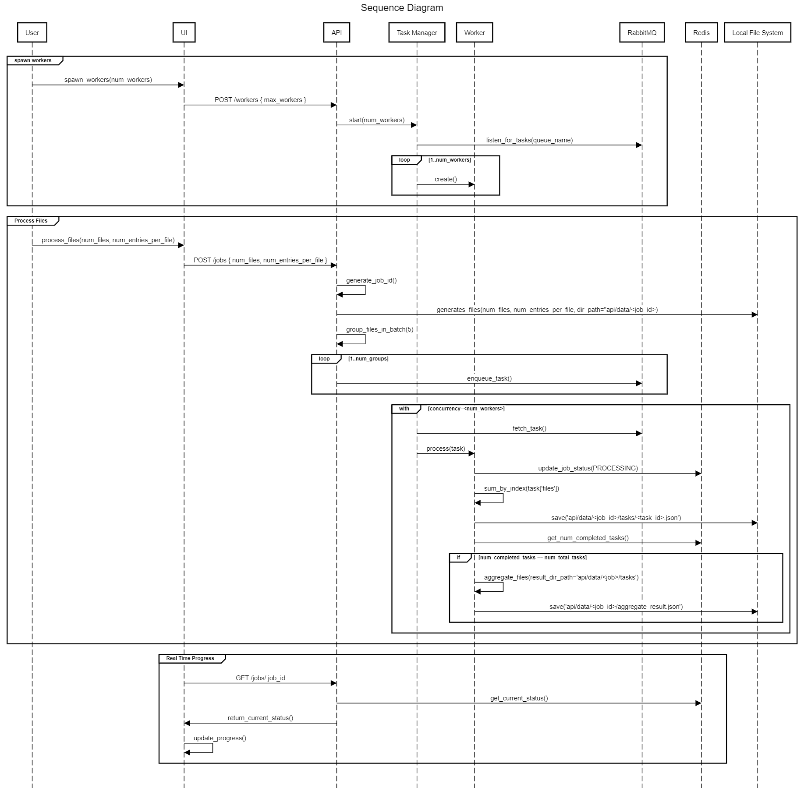

# Distributed File Processing

This repository holds a comprehensive system designed for distributed file processing. It includes a User Interface (UI) for easy system interaction, an Application Programming Interface (API) for seamless integration with other software, a queue system for efficient task management, and dedicated workers for concurrent execution of tasks

# For Developers

### Setup Environment

- Install node, npm (Recommended node: v16.14.2, npm: 8.5.0, tyepscript: )
- Install [redis](https://redis.io/docs/getting-started/installation/) (make sure it run on default port 6379)
- Install [rabbitmq](https://www.rabbitmq.com/download.html)

### Build and Run

```bash
./scripts/build-run.sh
```

# UI


- One job is divided into multiple tasks where each task contains at most 5 files. For example - for 50 files, 10 tasks will be created
- For now, you should start workers once only after starting the api server.

# Flow Diagram



# [Sequence Diagram](https://sequencediagram.org/index.html#initialData=C4S2BsFMAIGVII4FdIDsDGMAiICGBzAJ1wFsAoMgB10NHRGtWGgCIBVAZ0kJelw+hIqNOg1xNWbAJK9+gkMNoh6jZiwCCABRl8BuSgupKV4tQBV+Aa2gBZcQW6yB5I6NWsA6gHtClx7ugAd0U3U1YAJVwAIyiwGwBFJ2gEEOUxCRZwyAATEA4kwlSTDIAZL3RccGgAMRAoOABPDmBIEiSAMw4KMiIvJEpoDmpA1CCfP0IupABaAD4kEAAuQeHUAH1A8e4OAApUJBINrcmASjIFuf0l6E0AeVgzaAB6Td9t6ABvaBJcAA8jt6TaAAXzIVzmJGWzREewOAImHDOJDmCGW4DyLXW7R8a2AVl2yEgKDWqFIkDOvX60HAXi8AwA2gBGAB0zP2h1eCIAumRvnNAst0IRILgWjszmhsmRJRRKQNNIRypAOAJalApnMFstKIrMCq1u06srYYdDeqADTQdlrNDAQggZVrSjcA1Gs4XWZXZZ3B7PABWXiiAi+1rNyst1tt9sdzsIrvqoPBnoMy3waG4osgawDUTWIGy4rBBjmnVT6eILQ48eNoaNHAjcKjDqrserltyceowAAFgBeFhXJ7ZUW4J4AHhzeeyszOSa90Dl1arIHWUVF6G7OwArBTFVSaXToEzWda5RweUnUdA0ITiXiOJZCzK5UEwN2j+gvBgkIRhRgGr2Y7Wpy2yzDyyKzFe7SQMAG64lYhYQQK0A6kqKo7PelhnIEcyEMs-TDi02aBms0LAEguyaOEtwAMIAKKwLAUgAHIAOLYfyUJwlEDR5qg2SQL8GFWPSADkYYcKJXIcbMpaDLgABukA7KJg6EaOE4kfmsxPJhHDjphU6zMyfocF+okyXhC4wSScKfiQlBQC02TwQ+uxnD0e4DCA7RHta9mOTBOSuZYAi9r2VpwsAXh4uAIXnmQOGzMhBBEJA+CZkuOzChwSDgMAawdk6op9qpBhDiO445jpekWYlJYcFCinKWVIAVXiVVadOTypcKGVETleXACZZmoHVMoTfxspedAWSVNAZggCQMAKl4aUqucICXCm0CsXRjxPDm+mLJO+ZFltsxWWmBXoD+f4FWRFGFkmWrQMK5GEOst2-rapF4uR7mbZq1wEZlqHrYDMpAA)


