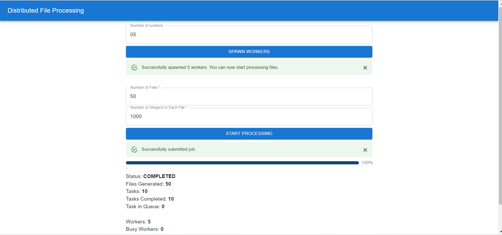

# Distributed File Processing

This repository holds a comprehensive system designed for distributed file processing. It includes a User Interface (UI) for easy system interaction, an Application Programming Interface (API) for seamless integration with other software, a queue system for efficient task management, and dedicated workers for concurrent execution of tasks

# For Developers

### Setup Environment

- Install node, npm (Recommended node: v16.14.2, npm: 8.5.0, tyepscript: )
- Install [redis](https://redis.io/docs/getting-started/installation/) (make sure it run on default port 6379)
- Install [rabbitmq](https://www.rabbitmq.com/download.html) 

### Build and Run

```bash
./scripts/build-run.sh
```

# UI



- One job is divided into multiple tasks where each task contains at most 5 files. For example - for 50 files, 10 tasks will be created
- For now, you should start workers once only after starting the api server.
